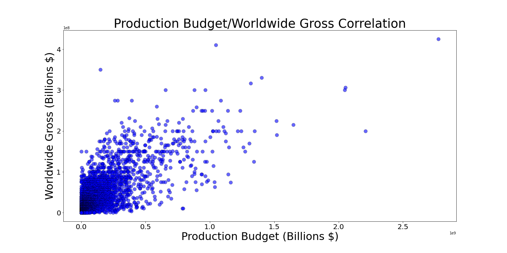
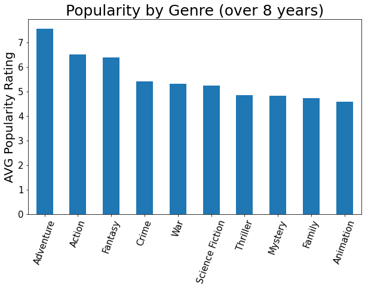
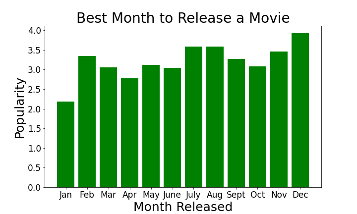

# Movie-Analysis-Project---Microsoft

## GENERAL OVERVIEW
 Streaming services have proven themselves worthy competitors against the long-standing "gatekeepers of film" - movie theaters. These competitors are alike in that they provide similar products and their goal is to make money, but a distinct difference between their business models is the WAY they make money. Movies at the theater make money through ticket sales, a one time payment in exchange for a one time expereince of the product. Streaming services make their money through subscriptions, a monthly payments that allows the viewer unlimited access to the product(s). One service is an event; a performance. 
 
## BUSINESS UNDERSTANDING
 This distinction is important to understand when analyzing the success of a particular film. It is easy to determine the success of a movie in the theater. All one must do is compare the budget of the film to the total amount of money the film grossed. Ticket sales provides you with a concrete answer to the question, "Was my film a success?" Streaming services however, are more complicated.    
   Streamers pay a subscription in exchange for access to the collective hub of films owned by the company. As such, it is far more difficult to directly relate a specific movie to the services' success. We cannot compare the budget of the film to the total grossed, because there is not variable, like tickets, to measure the total grossed. Subscriptions are the key as they are the source of income. So, we ask ourselves, "How do we entice people to sign up for our service?" To answer this question, we will use data from both the TMDB and TN databases to analyze:
    1. How does a films budget affect its overall succes?
    2. What have been the most popular genres?
    3. When should the movies release date be? 
After analysis, our team will provide budget, genre, and release date recommendations based on the results of our research.

## DATA UNDERSTANDING
Data Sources 
The Movie Database - The Movie Database (TMDB) is a community built movie and TV database. Every piece of data has been added by the community dating back to 2008. TMDb's strong international focus and breadth of data is largely unmatched. We will use their database to compare movie popularity in relation to both release date and genre. 

The Numbers - The Numbers was launched by Bruce Nash on October 17th, 1997 as a free resource for industry professionals, the investment community, and movie fans to track business information on movies. The site has grown to become the largest freely-available database of movie business information on the web. The Numbers now brings information on over 50,000 movies and nearly 200,000 people to the broadest audience possible. 

## DATA ANALYSIS

Production Budget/Worldwide Gross Correlation

The first two sets of data we focused on were worldwide gross and production budget. Our goal with these two data sets was to see what the correlation between the two was or if there was one. What we found is that there was a general positive correlation between the two, especially around a budget of $500,000,000 or greater. Obviously, this grand quantity of money is difficult for most people or groups of people to come by and therefore we observed that most movies won’t see extraordinary results as more money in a movie budget equals a greater chance for extraordinary results. 

Popularity By Genre

We used TMDB’s formula regarding popularity to create a metric for our visual to discern which movie genres have been the most popular recently. This formula is comprised of:  Number of votes for the day, Number of views for the day, Number of users who marked it as a "favourite" for the day, Number of users who added it to their "watchlist" for the day, Release date, Number of total votes, and Previous days score. What we found is that adventure, action, and fantasy are the three most popular movie genres by a relatively considerable margin, and therefore we garner that a new streaming platform should target at least one or more of these genres in order to increase the odds of their pilot movie or series to be popular.

Best Month to Release a Movie 

As the title denotes, our final visual centered around the best month to release a movie in regards to popularity. We found that movies were most popular in the summer and around the holidays in December. We hypothesize that this is due to kids being out of school during the summer as well as being on Christmas break during the month of December. Due to this popularity of movies, we actually decided that for a streaming service to have the best chance to succeed the streaming service would be best suited to release in January as movie theatres would not be nearly as popular, therefore the opportunity would be present in January to fill that void. 

## CONCLUSION
Based on the results of our research, we recommend An Adventurous Action Film that takes place in a Fantasy World with A budget >= $500,000,000 set to release in January. 

- An Action/Adventure/Fantasy movie would touch on the top 3 most popular genres. 
- The chances of financial success exponentially increase after $500,000,000 and money is no obstacle for Microsoft. 
- The streaming service will take advantage of "offseason" for movie theaters to their advantage, by launching their service then. 